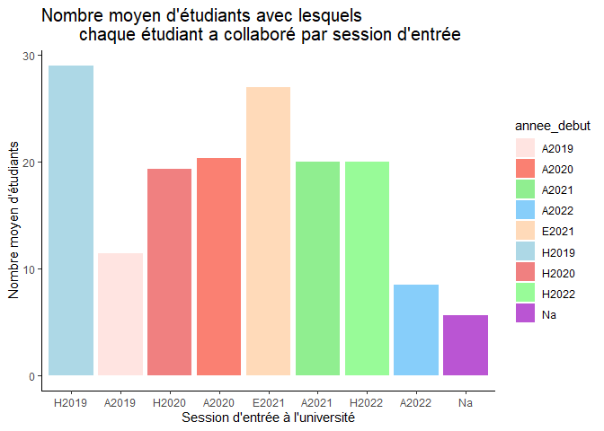

Rapport BIO500
================
Béatrice Dupuis, Félix-Olivier Dufour, Hugo Morin-Brassard, Rosalie
Gagnon  
2023-04-21

## Résumé

## Introduction

Les réseaux de collaboration écologique sont complexes et comportent
plusieurs niveaux d’interactions entre les organismes, ce qui peut
rapidement les rendre difficiles à comprendre. Pour se familiariser avec
ce concept, le cours de Méthodes en écologie computationnelle (BIO500)
offre la possibilité de recréer un réseau écologique à partir des
collaborations des étudiants du cours. Pour ce faire, différentes
informations ont été compilées tout d’abord par rapport à l’étudiant
lui-même, ensuite par rapport aux cours suivis par celui-ci puis
finalement avec qui cet étudiant à collaborer. Avec ces informations en
main, il sera possible d’établir un réseau de collaborations entre tous
les étudiants et de le comparer à un réseau d’interactions au sein d’un
écosystèmes naturels. Pour se faire, nous avons déterminer certaines
questions auxquelles nous essaieront de répondre. Les questions sur
lesquelles ce rapport ce penchera sont les suivantes : est-ce que les
élèves qui proviennent des mêmes régions administratives ont plus
tendances à travailler ensemble? On voudrait également savoir si les
élèves qui ont commencé le bac la même année auront tendance à plus
collaborer entre eux.

## Méthodes

Les données pour la réalisation de ce projet ont été acquise dans la
population d’étudiant du cours Méthodes en écologie computationnelle
(BIO500) à l’université de Sherbrooke (N = 38) au cours de la session
d’hiver 2023. Un document Excel a été rempli par chaque étudiant pour
enregistrer leurs informations personnelles, les cours qu’ils ont suivis
tout au long de leur parcours, ainsi que les collaborations effectuées
dans ces différents cours. Une collaboration a été défini dans ce projet
comme tout événements de coopération entre deux étudiants dans le cadre
de travaux scolaires. Par exemple, dans ce présent projet Béatrice a
collaboré avec 3 personnes, soit Félix-Olivier, Hugo et Rosalie. Par la
suite, étant donné la présence de doublon et d’erreurs de saisies, nous
avons élaboré un algorithme spécifique à nos données pour le nettoyage
de celles-ci.Ces données nettoyées ont ensuite été injecté dans une base
de données SQL qui nous a permis de réaliser nos analyses. Le nettoyage
des données et les analyses ont été effectué à l’aide du logiciel R (R
Core Team, 2023). Pour obtenir plus d’informations sur le nettoyage de
données, l’analyse de données ou les données en général, vous pouvez
consulter le dépôt de travail Github suivant
<https://github.com/HugoM-B/Bio500>.

## Résultats

<!-- -->

<!-- -->
<!-- -->

    ##                           region1                       region2
    ## 1           abitibi_temiscamingue              centre_du_quebec
    ## 2           abitibi_temiscamingue                        estrie
    ## 3           abitibi_temiscamingue                   laurentides
    ## 4           abitibi_temiscamingue                    monteregie
    ## 5               bas_saint_laurent              centre_du_quebec
    ## 6               bas_saint_laurent                        estrie
    ## 7               bas_saint_laurent                    lanaudiere
    ## 8               bas_saint_laurent                   laurentides
    ## 9               bas_saint_laurent                      mauricie
    ## 10              bas_saint_laurent                    monteregie
    ## 11              bas_saint_laurent                      montreal
    ## 12              bas_saint_laurent       saguenay_lac_saint_jean
    ## 13               centre_du_quebec         abitibi_temiscamingue
    ## 14               centre_du_quebec             bas_saint_laurent
    ## 15               centre_du_quebec                        estrie
    ## 16               centre_du_quebec gaspesie_iles_de_la_madeleine
    ## 17               centre_du_quebec                    lanaudiere
    ## 18               centre_du_quebec                   laurentides
    ## 19               centre_du_quebec                      mauricie
    ## 20               centre_du_quebec                    monteregie
    ## 21               centre_du_quebec                    monterigie
    ## 22               centre_du_quebec                      montreal
    ## 23                         estrie         abitibi_temiscamingue
    ## 24                         estrie             bas_saint_laurent
    ## 25                         estrie              centre_du_quebec
    ## 26                         estrie                        estrie
    ## 27                         estrie gaspesie_iles_de_la_madeleine
    ## 28                         estrie                    lanaudiere
    ## 29                         estrie                   laurentides
    ## 30                         estrie                         laval
    ## 31                         estrie                      mauricie
    ## 32                         estrie                    monteregie
    ## 33                         estrie                    monterigie
    ## 34                         estrie                      montreal
    ## 35                         estrie                     outaouais
    ## 36                         estrie       saguenay_lac_saint_jean
    ## 37  gaspesie_iles_de_la_madeleine              centre_du_quebec
    ## 38  gaspesie_iles_de_la_madeleine                        estrie
    ## 39  gaspesie_iles_de_la_madeleine                    lanaudiere
    ## 40  gaspesie_iles_de_la_madeleine                   laurentides
    ## 41  gaspesie_iles_de_la_madeleine                    monteregie
    ## 42  gaspesie_iles_de_la_madeleine                    monterigie
    ## 43  gaspesie_iles_de_la_madeleine                     outaouais
    ## 44                     lanaudiere             bas_saint_laurent
    ## 45                     lanaudiere              centre_du_quebec
    ## 46                     lanaudiere                        estrie
    ## 47                     lanaudiere gaspesie_iles_de_la_madeleine
    ## 48                     lanaudiere                   laurentides
    ## 49                     lanaudiere                      mauricie
    ## 50                     lanaudiere                    monteregie
    ## 51                     lanaudiere                    monterigie
    ## 52                     lanaudiere                      montreal
    ## 53                     lanaudiere                     outaouais
    ## 54                    laurentides         abitibi_temiscamingue
    ## 55                    laurentides             bas_saint_laurent
    ## 56                    laurentides              centre_du_quebec
    ## 57                    laurentides                        estrie
    ## 58                    laurentides gaspesie_iles_de_la_madeleine
    ## 59                    laurentides                    lanaudiere
    ## 60                    laurentides                   laurentides
    ## 61                    laurentides                         laval
    ## 62                    laurentides                      mauricie
    ## 63                    laurentides                    monteregie
    ## 64                    laurentides                    monterigie
    ## 65                    laurentides                      montreal
    ## 66                    laurentides                     outaouais
    ## 67                          laval                        estrie
    ## 68                          laval                   laurentides
    ## 69                          laval                    monteregie
    ## 70                          laval                    monterigie
    ## 71                          laval                      montreal
    ## 72                          laval       saguenay_lac_saint_jean
    ## 73                       mauricie             bas_saint_laurent
    ## 74                       mauricie              centre_du_quebec
    ## 75                       mauricie                        estrie
    ## 76                       mauricie                    lanaudiere
    ## 77                       mauricie                   laurentides
    ## 78                       mauricie                    monteregie
    ## 79                       mauricie                      montreal
    ## 80                       mauricie       saguenay_lac_saint_jean
    ## 81                     monteregie         abitibi_temiscamingue
    ## 82                     monteregie             bas_saint_laurent
    ## 83                     monteregie              centre_du_quebec
    ## 84                     monteregie                        estrie
    ## 85                     monteregie gaspesie_iles_de_la_madeleine
    ## 86                     monteregie                    lanaudiere
    ## 87                     monteregie                   laurentides
    ## 88                     monteregie                         laval
    ## 89                     monteregie                      mauricie
    ## 90                     monteregie                    monteregie
    ## 91                     monteregie                    monterigie
    ## 92                     monteregie                      montreal
    ## 93                     monteregie                     outaouais
    ## 94                     monteregie       saguenay_lac_saint_jean
    ## 95                     monterigie              centre_du_quebec
    ## 96                     monterigie                        estrie
    ## 97                     monterigie gaspesie_iles_de_la_madeleine
    ## 98                     monterigie                    lanaudiere
    ## 99                     monterigie                   laurentides
    ## 100                    monterigie                         laval
    ## 101                    monterigie                    monteregie
    ## 102                    monterigie                     outaouais
    ## 103                    monterigie       saguenay_lac_saint_jean
    ## 104                      montreal             bas_saint_laurent
    ## 105                      montreal              centre_du_quebec
    ## 106                      montreal                        estrie
    ## 107                      montreal                    lanaudiere
    ## 108                      montreal                   laurentides
    ## 109                      montreal                         laval
    ## 110                      montreal                      mauricie
    ## 111                      montreal                    monteregie
    ## 112                      montreal       saguenay_lac_saint_jean
    ## 113                     outaouais                        estrie
    ## 114                     outaouais gaspesie_iles_de_la_madeleine
    ## 115                     outaouais                    lanaudiere
    ## 116                     outaouais                   laurentides
    ## 117                     outaouais                    monteregie
    ## 118                     outaouais                    monterigie
    ## 119       saguenay_lac_saint_jean             bas_saint_laurent
    ## 120       saguenay_lac_saint_jean                        estrie
    ## 121       saguenay_lac_saint_jean                         laval
    ## 122       saguenay_lac_saint_jean                      mauricie
    ## 123       saguenay_lac_saint_jean                    monteregie
    ## 124       saguenay_lac_saint_jean                    monterigie
    ## 125       saguenay_lac_saint_jean                      montreal
    ##     nb_collaborations distance nb_collabo
    ## 1                   4        3         32
    ## 2                   4        4         32
    ## 3                   8        3         32
    ## 4                  16        3         32
    ## 5                   2        3         54
    ## 6                  11        3         54
    ## 7                   1        4         54
    ## 8                   1        4         54
    ## 9                  12        3         54
    ## 10                 24        4         54
    ## 11                  2        5         54
    ## 12                  1        3         54
    ## 13                  4        3         91
    ## 14                  2        3         91
    ## 15                 26        2         91
    ## 16                  5        4         91
    ## 17                  4        2         91
    ## 18                  1        3         91
    ## 19                  7        2         91
    ## 20                 28        2         91
    ## 21                  2        2         91
    ## 22                 12        3         91
    ## 23                  4        4        275
    ## 24                 11        3        275
    ## 25                 26        2        275
    ## 26                 83        1        275
    ## 27                 17        4        275
    ## 28                  3        3        275
    ## 29                  9        3        275
    ## 30                  8        4        275
    ## 31                 11        3        275
    ## 32                 74        2        275
    ## 33                 20        2        275
    ## 34                  5        3        275
    ## 35                  3        4        275
    ## 36                  1        4        275
    ## 37                  5        4         40
    ## 38                 17        4         40
    ## 39                  1        5         40
    ## 40                  2        5         40
    ## 41                 12        5         40
    ## 42                  2        5         40
    ## 43                  1        5         40
    ## 44                  1        4         42
    ## 45                  4        2         42
    ## 46                  3        3         42
    ## 47                  1        5         42
    ## 48                  3        2         42
    ## 49                  1        2         42
    ## 50                 21        2         42
    ## 51                  1        2         42
    ## 52                  6        2         42
    ## 53                  1        3         42
    ## 54                  8        3         66
    ## 55                  1        4         66
    ## 56                  1        3         66
    ## 57                  9        3         66
    ## 58                  2        5         66
    ## 59                  3        2         66
    ## 60                 12        1         66
    ## 61                  1        2         66
    ## 62                  2        2         66
    ## 63                 20        2         66
    ## 64                  4        2         66
    ## 65                  2        2         66
    ## 66                  1        2         66
    ## 67                  8        4         35
    ## 68                  1        2         35
    ## 69                 14        3         35
    ## 70                  1        3         35
    ## 71                 10        2         35
    ## 72                  1        4         35
    ## 73                 12        3         52
    ## 74                  7        2         52
    ## 75                 11        3         52
    ## 76                  1        2         52
    ## 77                  2        2         52
    ## 78                 13        2         52
    ## 79                  5        3         52
    ## 80                  1        2         52
    ## 81                 16        3        526
    ## 82                 24        4        526
    ## 83                 28        2        526
    ## 84                 75        2        526
    ## 85                 12        5        526
    ## 86                 21        2        526
    ## 87                 20        2        526
    ## 88                 14        3        526
    ## 89                 13        2        526
    ## 90                210        1        526
    ## 91                 13        1        526
    ## 92                 35        2        526
    ## 93                  6        3        526
    ## 94                 39        3        526
    ## 95                  2        2         49
    ## 96                 20        2         49
    ## 97                  2        5         49
    ## 98                  1        2         49
    ## 99                  4        2         49
    ## 100                 1        3         49
    ## 101                13        1         49
    ## 102                 5        3         49
    ## 103                 1        3         49
    ## 104                 2        5         79
    ## 105                12        3         79
    ## 106                 5        3         79
    ## 107                 6        2         79
    ## 108                 2        2         79
    ## 109                10        2         79
    ## 110                 5        3         79
    ## 111                35        2         79
    ## 112                 2        4         79
    ## 113                 3        4         17
    ## 114                 1        5         17
    ## 115                 1        3         17
    ## 116                 1        2         17
    ## 117                 6        3         17
    ## 118                 5        3         17
    ## 119                 1        3         46
    ## 120                 1        4         46
    ## 121                 1        4         46
    ## 122                 1        2         46
    ## 123                39        3         46
    ## 124                 1        3         46
    ## 125                 2        4         46

    ## Warning: le package 'gplots' est en cours d'utilisation et ne sera pas installé

<!-- -->

## Discussions

## Bibliographie
