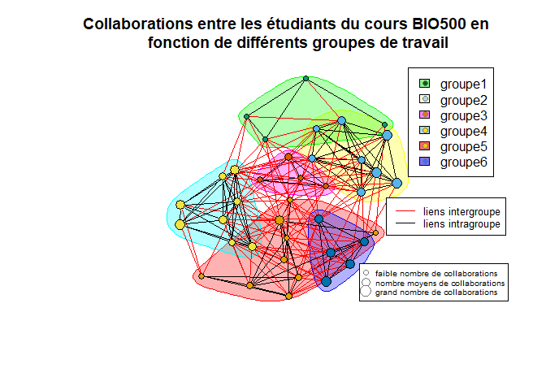

Rapport BIO500
================
Béatrice Dupuis, Félix-Olivier Dufour, Hugo Morin-Brassard, Rosalie
Gagnon  
2023-04-21

## Résumé

Nous avons mené une expérience scientifique qui avait pour but de
produire un réseau de collaborations entre les étudiants de la classe du
cours de BIO500, pour éventuellement faire des parallèles bouetteux avec
les interactions observables dans un réseau écologique naturel. Pour se
faire, nous avons établi des questions claires afin d’atteindre nos
objectifs. On s’intéressait alors à l’influence des différences sociales
sur la nature et la fréquence des collaborations entre les individus.
Les différences que nous suspections d’influencer le comportement social
des étudiants étaient la session d’entrée au bac des individus et leur
région administrative d’origine. L’origine géographique des étudiants
nous a permis d’obtenir des résultats plus concluants que la session
d’entrée pour ce qui est de leur influence sur les collaborations.

## Introduction

Les réseaux de collaboration écologique sont complexes à étudier et les
interactions entre les organismes dépendent de plusieurs facteurs. Pour
se familiariser avec ce concept, le cours de BIO500 offre la possibilité
de recréer un réseau à partir des collaborations des étudiants du cours.
Pour se faire, différentes informations ont été compilées par rapport à
l’étudiant lui-même, par rapport aux cours qu’il a suivis et par rapport
aux collaborations qu’il a effectuées. Avec ces informations en main, il
sera possible d’établir un réseau de collaborations entre tous les
étudiants et de le comparer à un réseau d’interactions au sein d’un
écosystèmes naturels. Pour se faire, nous avons déterminer certaines
questions auxquelles nous essaieront de répondre. Les questions sur
lesquelles ce rapport se penchera sont les suivantes : Est-ce que les
élèves provenant d’une même région administrative ou de régions à
proximité ont plus tendance à travailler ensemble que ceux provenant de
deux régions distantes? Est-ce que les étudiants qui ont commencé le bac
au même moment auront tendance à collaborer plus entre eux qu’avec ceux
d’une autre cohorte.

## Méthodes

Les données pour la réalisation de ce projet ont été extraites de la
population d’étudiants (N = 38) du cours de BIO500 à l’Université de
Sherbrooke offert à la session d’hiver 2023. Un document Excel a été
complété par chaque étudiant pour relever leurs informations
personnelles, les cours qu’ils ont suivis tout au long de leur parcours
ainsi que les collaborations effectuées dans ces différents cours. Dans
ce projet, une collaboration est définie comme tout événement de
coopération entre deux étudiants dans le cadre de travaux scolaires. Par
exemple, dans ce présent projet Béatrice a effectué trois collaborations
avec trois personnes différentes, soit Félix-Olivier, Hugo et Rosalie.
Par la suite, la présence de doublons et d’erreurs de saisie nous a
obligé à élaborer un algorithme spécifique à nos données afin de
nettoyer les imperfections. Ces données nettoyées ont ensuite été
injectées dans une base de données SQL qui nous a permis de réaliser nos
analyses. Le nettoyage des données et les analyses ont été effectués à
l’aide du logiciel R (R Core Team, 2023). Pour obtenir plus
d’informations sur le nettoyage de données, l’analyse de données ou les
données en général, consultez le dépôt de travail Github suivant
<https://github.com/HugoM-B/Bio500>.

Nous avons aussi instauré un système de côte pour représenter la
distance géographique entre les différentes régions administratives.
Chaque collaboration s’est vu attribuer une côte selon le chemin le plus
court entre les régions administratives de ses collaborateurs. Les
collaborations s’étant fait assigner une côte de 1 comptent deux
individus provenant de la même région, celles ayant une côte de 3
comptent des individus provenant de deux régions moyennement éloignées
(exemple: Estrie-Bas-Saint-Laurent) et celles ayant une côte de 5
comptent des individus provenant de deux régions très éloignés (exemple:
Gaspésie-îles-de-la-Madelaine – Abitibi-Témiscamingue). Noter que le
fleuve St-Laurent a été considéré comme une frontière adjacente entre
les régions de part et d’autre de celui-ci. La côte attribuée aux
collaborations entre un individu provenant de la Côte-Nord et un
provenant du Bas-Saint-Laurent serait donc de 2. Pour finir, nous avons
injecté ces données dans une matrice de 16 x 16.

## Résultats

<!-- -->

<!-- -->
<!-- -->

<!-- -->

## Discussion

Figure 1: On remarque que les collaborations les plus fréquentes sont
celles qui figurent entre les étudiants qui ont commencé le bac à la
session d’automne 2020. Ceux-ci présentent nettement plus de
collaboration entre eux qu’avec ceux provenant des autres cohortes.
Ensuite, les individus qui sont entrés à l’hiver 2020 présentent plus de
collaboration avec les étudiants entrés à l’automne 2020 qu’avec les
étudiants de leur propre cohorte. On ne peut pas vraiment décréter qu’il
y a une tendance qui relie la collaboration à l’année de début du bac
puisqu’il y a un biais majeur lié à la quantité d’individus des
différentes cohortes. Il est donc normal d’avoir plus de collaborations
entre les étudiants de la cohorte de l’automne 2020 étant donné que le
cheminement universitaire typique suggère le cours de BIO500 aux
étudiants de la cohorte d’automne 2020, c’est-à-dire pendant leur S5.
Pour annuler l’effet de l’abondance respective de chaque cohorte, il
aurait fallu représenter notre graphique au prorata. On suppose donc que
le biais induit par la quantité d’individus respective de chaque cohorte
est trop grand pour tirer des conclusions satisfaisantes.

Figure 2: Ce graphique représente la proportion de collaboration
effectuée par les étudiants en fonction d’une côte arbitraire reflétant
la distance entre la région administrative d’origine des collaborateurs
potentiels et leur propre région. On observe de façon assez évidente que
plus les collaborateurs proviennent de régions éloignées moins ils
auront tendance à collaborer ensemble. Le graphique est réalisé
proportionnellement au nombre de collaboration inter-régional ce qui
diminue le biais. Par exemple si on a 10 personnes qui vienne de
l’Estrie et 2 qui viennent du Saguenay, c’est normal que les gens de
l’Estrie collaborent plus ensemble puisque statistiquement ils ont plus
de chances. Cependant en ramenant les proportions sur le nombre de
collaboration par région, on diminue ce biais. Cette figure nous montre
donc que plus les individus proviennent de régions rapprochées, et
possiblement semblables, plus les collaborations sont fréquentes,
peut-être même que ces constatations sont dues à un début de spéciation
entre les groupes. Le phénomène observé se compare aussi à l’isolement
génétique par la distance chez les espèces moyennement mobile (Perez et
al. 2018). Il est important de noter que cette analyse s’est penchée
uniquement sur les collaborations entres les étudiants du cours BIO500
afin d’éviter de sous représenter les interactions avec les régions
connu au dépend de celles avec des régions non-définis. La taille
d’échantillon de 38 est relativement faible pour observer un isolement
par la distance sur un échelle de 1 à 6 ce qui explique possiblement que
nos intervalles de confiance se chevauchent et incluent bien souvent 0.
Par contre, on observe tout de même une tendance appuyant les
observations faites plus haut.

Figure 3 : Ce graphique illustre le nombre de collaborateurs différents
moyen des individus selon leur session d’entrée dans le bac. Toutefois,
certaines bandes incorporent les données provenant d’un seul étudiant,
comme celle de l’été 2021 ou celle de l’hiver 2019, alors que d’autres
incorporent les données provenant de plusieurs étudiants. Si on accepte
la prémisse comme quoi l’étudiant entré au bac plus tôt est plus avancé
dans son cheminement scolaire, et que les collaborations se font de
manière panmictique, alors on devrait observer une tendance de
décroissance dans le nombre de différents collaborateurs plus on avance
dans les années de début de bac. La bande illustrant le nombre de
collaborateurs différents des étudiants entrés à l’automne 2019 est
nettement plus basse que ce à quoi on s’attendrait. Cela suggère que les
individus de cette cohorte ont généralement collaboré avec les mêmes
partenaires.

Figure 4: Dans ce graphique, les points représentent un individu
participant au cours de bio500 et la grosseur des points grosseur son
nombre de collaboration. Les traits rouges et noirs représentent une
collaboration avec un autre individu. On peut voir plusieurs petits
sous-groupes dans la classe qui priorise les interactions entre eux mais
qui peuvent aussi faire des interactions avec d’autres membres du groupe
qui font partie de sous-groupe différents. Comme plusieurs petites
communautés qui forment une grande métacommuanuté (Meynard, n.d.). Ce
genre de système de collaboration rappel le modèle d’isolement par la
distance en iles ou les individus faisant parti d’un sous-groupe
priorisent la reproduction au sein du même sous-groupe à l’exception de
quelques migrants. (Wright 1943).

## conclusion

Pour conclure, il y a trop un gros biais via le nombre d’étudiants qui
sont entrée à l’automne par rapport aux autres sessions pour en tirer
une conclusion pertinente. Cependant, on observe bel et bien un lien
entre les collaborateurs qui viennent des mêmes régions administratives.
Les gens qui viennent de régions proches les unes des autres ont plus
tendances à collaborer ensemble que les gens de régions éloignés.

## Bibliographie

Meynard, Christine N. n.d. “Aires de Répartitions, Métacommunautés Et
Biodiversité : Du Théorique à l’appliqué.”

Perez, Manolo F., Fernando F. Franco, Juliana R. Bombonato, Isabel A. S.
Bonatelli, Gulzar Khan, Monique Romeiro-Brito, Ana C. Fegies, Paulianny
M. Ribeiro, Gislaine A. R. Silva, and Evandro M. Moraes. 2018.
“Assessing Population Structure in the Face of Isolation by Distance:
Are We Neglecting the Problem?” *Diversity and Distributions* 24 (12):
1883–89. <https://doi.org/10.1111/ddi.12816>.

Wright, Sewall. 1943. “Isolation by Distance.” *Genetics* 28 (2):
114–38. <https://www.ncbi.nlm.nih.gov/pmc/articles/PMC1209196/>.

